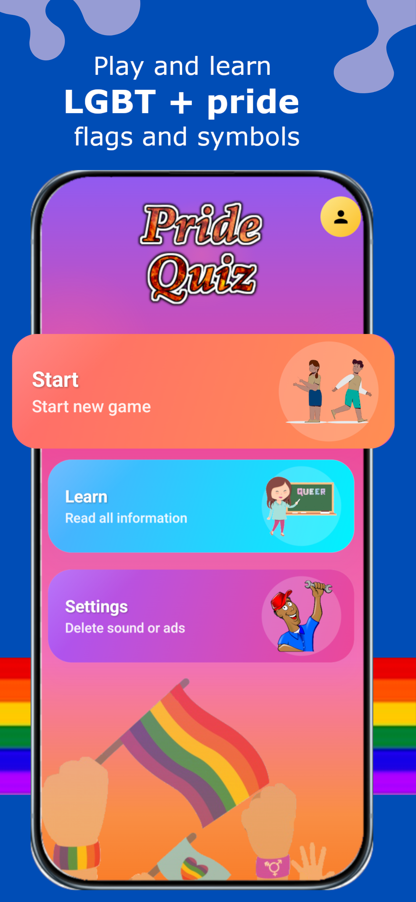
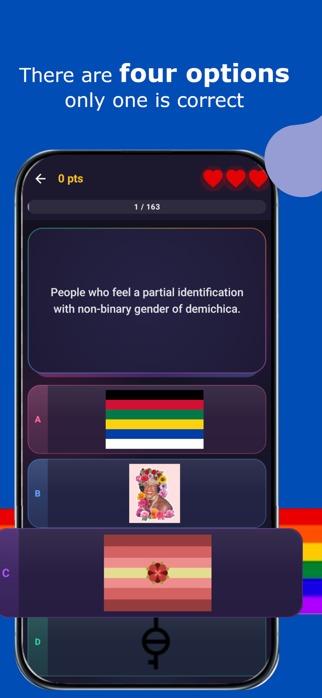
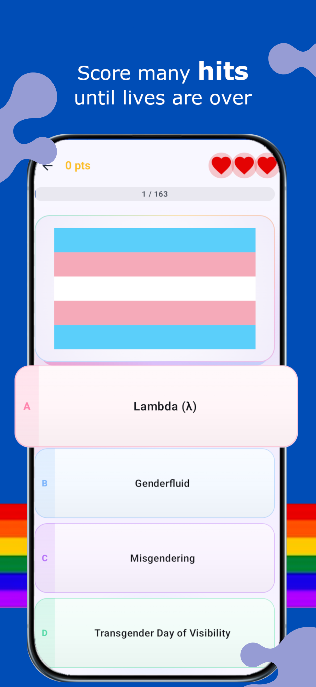
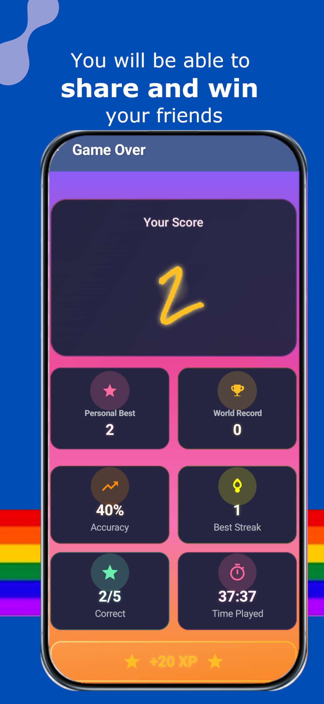
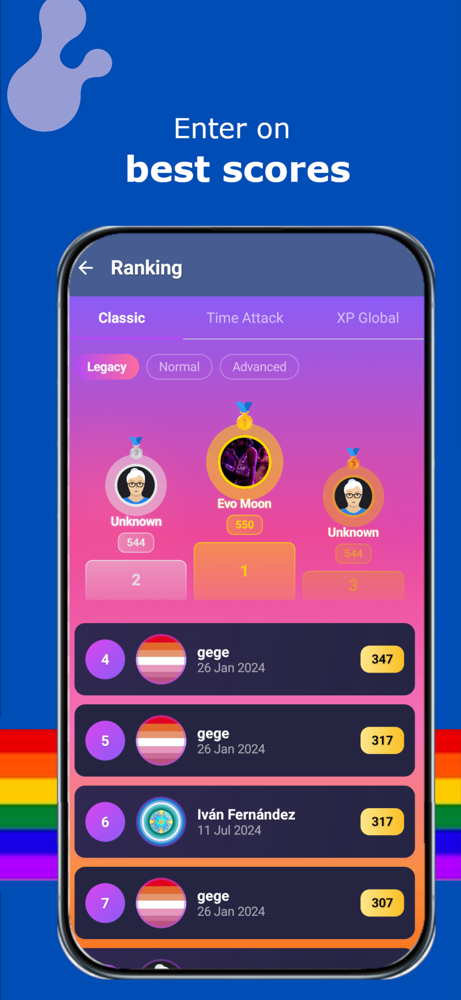
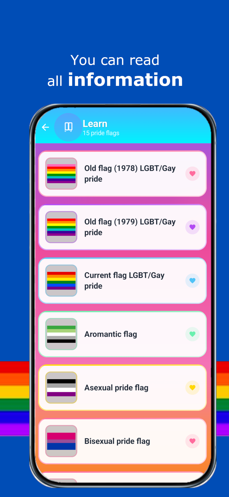
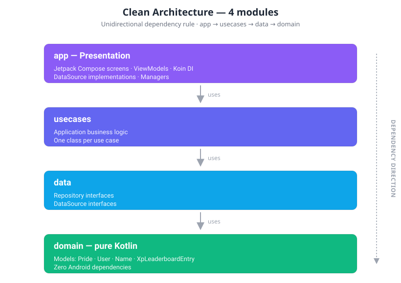
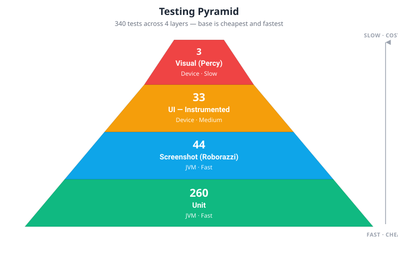

# PrideQuiz

[](https://github.com/AlvaroQ/PrideQuiz/actions/workflows/ci.yml)
[](https://play.google.com/store/apps/details?id=com.quiz.pride)


[](LICENSE)

---

## Table of Contents

[About](#about) · [Screenshots](#screenshots) · [Tech Stack](#tech-stack) · [Architecture](#architecture) · [Features](#features) · [Why these choices](#why-these-choices) · [Testing](#testing) · [Getting Started](#getting-started) · [Links](#links) · [License](#license)

---

## About

PrideQuiz is an Android quiz game that tests your knowledge of LGBTQ+ history, culture, symbols, and icons. Players can challenge themselves in Normal mode or race against the clock in Time Attack, earning XP, climbing global leaderboards, and unlocking progression titles along the way.

---

## Screenshots

<table align="center">
  <tr>
    <td align="center"><br/><sub>Game mode selection</sub></td>
    <td align="center"><br/><sub>Quiz question in play dark</sub></td>
    <td align="center"><br/><sub>Quiz question in play light</sub></td>
  </tr>
  <tr>
    <td align="center"><br/><sub>Result & XP earned</sub></td>
    <td align="center"><br/><sub>Ranking</sub></td>
    <td align="center"><br/><sub>Learn</sub></td>
  </tr>
</table>

---

## Tech Stack

| Category               | Technology                                                      | Version           |
| ---------------------- | --------------------------------------------------------------- | ----------------- |
| Language               | Kotlin                                                          | 2.3.20            |
| Build                  | Android Gradle Plugin                                           | 9.1.1             |
| UI                     | Jetpack Compose + Material3                                     | BOM 2026.03.01    |
| Architecture           | Clean Architecture — 4 modules                                  | MVVM              |
| State Management       | StateFlow + SharedFlow                                          | Coroutines 1.10.2 |
| Dependency Injection   | Koin (Android + Compose)                                        | 4.2.1             |
| Backend                | Firebase (Firestore, Realtime DB, Auth, Analytics, Crashlytics) | BOM 34.12.0       |
| Images                 | Coil Compose                                                    | 3.4.0             |
| Functional Programming | Arrow Core (Either)                                             | 2.2.2.1           |
| Local Persistence      | DataStore Preferences                                           | 1.2.1             |
| Monetization           | AdMob + Google Play Billing                                     | 25.2.0 / 8.3.0    |
| Min SDK                | Android 8.0 (Oreo)                                              | API 26            |
| Compile / Target SDK   | Android 15                                                      | API 36            |

---

## Architecture

PrideQuiz follows **Clean Architecture** with a strict unidirectional dependency rule across four Gradle modules:

<p align="center">
  
</p>

ViewModels expose `StateFlow` for UI state and `SharedFlow` for one-shot events (navigation, dialogs). Koin handles dependency injection at every layer.

---

## Features

- Normal and Time Attack game modes
- XP progression system with levels and unlockable titles
- Global leaderboard powered by Firestore
- Personal records tracked locally
- Light / Dark theme with Material3 Dynamic Colors (Android 12+)
- High contrast and large text accessibility support
- AdMob monetization: banner, interstitial, and rewarded ads
- In-app billing to permanently remove ads

---

## Why these choices

A short rationale behind the non-obvious architectural decisions. Every choice is a tradeoff — these notes explain what was gained and what was given up.

### Four Gradle modules, not packages

`domain`, `data`, `usecases`, and `app` are separate Gradle modules, not just packages inside one `:app`. The Dependency Rule is enforced by the build system itself — if `domain` tried to import anything Android, Gradle wouldn't compile it. As a side effect, incremental builds only recompile the layer that changed, and it makes the eventual migration of `domain` to Kotlin Multiplatform a low-friction step.

**Tradeoff:** more `build.gradle` files and a slightly heavier initial setup. For a project expected to live for years and ship updates, it pays off on day two.

### Koin over Hilt

Koin was picked for faster iteration in a Kotlin-first, Compose-heavy codebase. No `kapt` / `ksp` in the DI path means shorter incremental builds, and the composable-friendly API (`koinInject()`, `koinViewModel()`) doesn't require annotation processors to wire dependencies into the UI layer.

**Tradeoff:** Koin resolves graphs at runtime, not compile time — a missing binding surfaces as a crash on first use, not as a red squiggle. Mitigated here with `verify()` coverage in the unit-test suite for every module.

### Arrow `Either` for expected failures

Repository and use-case methods that can legitimately fail — network errors, empty Firestore queries, validation — return `Either<Failure, T>` instead of throwing. Failures become part of the type signature, so ViewModels are forced by the compiler to handle them before emitting UI state.

**Tradeoff:** one more dependency and a small learning curve for contributors new to functional Kotlin. Exceptions are still used for what they're meant for: programmer errors and truly unexpected state.

### MVVM with StateFlow, not MVI

ViewModels expose a `StateFlow<UiState>` for reactive state and a `SharedFlow<UiEvent>` for one-shot events (navigation, snackbars). Compose collects both and stays a pure function of state. This gives the guarantees that matter from unidirectional data flow — single source of truth per screen, configuration-change safety, no observer leaks — without the `Intent → Reducer → State` ceremony of a full MVI setup.

**Tradeoff:** ViewModels expose multiple intent methods (`onAnswerSelected`, `onTimerExpired`) instead of a single `processIntent(intent)` channel, so the "all state changes go through one place" invariant is a convention, not a compile-time guarantee. Acceptable at this project's screen complexity — MVI would be worth adopting if any screen grew beyond ~8 interdependent state fields or if event replay became a debugging need.

### Firebase-only backend (no custom server)

Firestore handles quiz content and leaderboards, Realtime Database powers live ranking updates, Auth handles anonymous sessions, Analytics and Crashlytics cover observability. There is no custom backend to maintain, deploy, or pay for — the free tier covers the current scale.

**Tradeoff:** vendor lock-in and limited query expressiveness compared to SQL. Acceptable here because the domain (short quiz questions, append-only leaderboard entries) maps cleanly onto document collections, and the operational cost of running a server would outweigh any flexibility gained.

---

## Testing

PrideQuiz has a comprehensive, multi-layer testing strategy covering unit logic, UI components, visual regression, and full end-to-end visual flows on real devices.

<p align="center">
  
</p>

### At a glance

| Type                    | Tests   | Runs on           | Speed  | Command                               |
| ----------------------- | ------- | ----------------- | ------ | ------------------------------------- |
| Unit                    | 260     | JVM               | Fast   | `./gradlew test`                      |
| UI — Instrumented       | 33      | Device / Emulator | Medium | `./gradlew connectedDebugAndroidTest` |
| Screenshot — Roborazzi  | 44      | JVM               | Fast   | `./gradlew verifyRoborazziDebug`      |
| Visual — Appium + Percy | 3 specs | Device            | Slow   | `npm run test:percy`                  |

Detailed configuration for each layer follows below.

---

### Unit Tests — 260 tests

|          |                                                                     |
| -------- | ------------------------------------------------------------------- |
| Location | `app/src/test/`, `data/src/test/`, `usecases/src/test/`             |
| Coverage | ViewModels, Managers, Repositories, Use Cases, Koin DI verification |
| Stack    | JUnit 4, MockK, Turbine (Flow testing), Koin Test                   |
| Runs on  | JVM (no device required)                                            |

```bash
./gradlew test
```

---

### UI Tests — Instrumented — 33 tests

|          |                                                                                                                                             |
| -------- | ------------------------------------------------------------------------------------------------------------------------------------------- |
| Location | `app/src/androidTest/`                                                                                                                      |
| Coverage | GameScreen components, ResultScreen components: `LoadingIndicator`, `TopBar`, `AnswerButtons`, `ScoreDisplay`, `StatsGrid`, `ActionButtons` |
| Stack    | Compose UI Test with JUnit4 rule                                                                                                            |
| Runs on  | Connected device or emulator                                                                                                                |

```bash
./gradlew connectedDebugAndroidTest
```

---

### Screenshot Tests — Roborazzi — 44 tests

Roborazzi screenshot tests run entirely on the JVM (via Robolectric) and provide fast visual regression coverage across multiple theme configurations.

|            |                                                                                                                                  |
| ---------- | -------------------------------------------------------------------------------------------------------------------------------- |
| Location   | `app/src/test/java/com/quiz/pride/screenshots/`                                                                                  |
| Coverage   | All major UI components across 4 theme variants: Light, Dark, High Contrast Light, High Contrast Dark + Large Text accessibility |
| Stack      | Roborazzi 1.59.0, Robolectric 4.16.1                                                                                             |
| Runs on    | JVM (no device required)                                                                                                         |
| Test files | `GameComponentsScreenshotTest`, `ResultComponentsScreenshotTest`, `ThemeScreenshotTest`                                          |

```bash
# Record baselines
./gradlew recordRoborazziDebug

# Verify against recorded baselines
./gradlew verifyRoborazziDebug

# Generate HTML report
./gradlew generateScreenshotReport
```

Report output: `app/build/reports/screenshots/index.html`

---

### Visual Regression Tests — Appium + Percy — 3 specs

Full end-to-end visual regression tests that capture real device rendering and compare screenshots using Percy's AI-powered visual diff dashboard.

|          |                                                                          |
| -------- | ------------------------------------------------------------------------ |
| Location | `appium-visual-tests/`                                                   |
| Coverage | Full-screen visual regression across complete user flows on real devices |
| Stack    | Appium 3.2, WebdriverIO 9, Percy (BrowserStack)                          |
| Runs on  | Connected device                                                         |

```bash
npm run test:percy
```

Setup and configuration: see `appium-visual-tests/README.md`

---

## Getting Started

### Prerequisites

- **JDK 17+** (required by Android Gradle Plugin 9.x)
- **Android Studio Ladybug (2024.2)** or newer
- **Android SDK 36** installed via SDK Manager
- A Firebase project with `google-services.json` (Firestore, Realtime Database, Auth, Analytics and Crashlytics enabled)
- AdMob account for ad unit IDs (test IDs work out of the box in `debug` builds)

### Setup

1. Clone the repository:
   ```bash
   git clone https://github.com/AlvaroQ/PrideQuiz.git
   ```

2. Add your `google-services.json` (Firebase) to the `app/` directory.

3. Add AdMob keys to `local.properties`:
   ```properties
   ADMOB_APP_ID=ca-app-pub-xxxxxxxxxxxxxxxx~xxxxxxxxxx
   ADMOB_BANNER_ID=ca-app-pub-xxxxxxxxxxxxxxxx/xxxxxxxxxx
   ADMOB_INTERSTITIAL_ID=ca-app-pub-xxxxxxxxxxxxxxxx/xxxxxxxxxx
   ADMOB_REWARDED_ID=ca-app-pub-xxxxxxxxxxxxxxxx/xxxxxxxxxx
   ```

4. Build the debug APK:
   ```bash
   ./gradlew assembleDebug
   ```

---

## Links

- [Play Store listing](https://play.google.com/store/apps/details?id=com.quiz.pride) — install PrideQuiz on your device
- [Report a bug](https://github.com/AlvaroQ/PrideQuiz/issues/new?labels=bug) — something broken or unexpected
- [Request a feature](https://github.com/AlvaroQ/PrideQuiz/issues/new?labels=enhancement) — propose an improvement
- [CI workflows](https://github.com/AlvaroQ/PrideQuiz/actions) — latest build, test and visual regression runs

---

## License

Released under the [Apache License 2.0](LICENSE). You are free to use, modify, and distribute the code with attribution.
